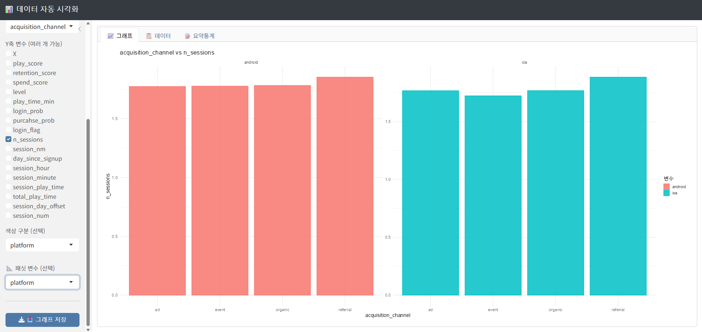

# R Shiny 기반 데이터 시각화 앱 

## 1. 프로젝트 개요

본 프로젝트는 반복적인 탐색적 데이터 분석 과정을 효율화하기 위해 제작한 R Shiny 기반 데이터 시각화 웹앱입니다. 사용자가 CSV 파일을 업로드한 후 옵션을 선택하여 별도의 코드 작성없이 ggplot2 그래프를 그릴 수 있습니다. 

## 2. 제작 배경
데이터 분석 과정에서 데이터 시각화가 필요한 경우가 많았고 매번 코드에서 변수명과 그래프 옵션을 수정하는 과정이 비효율적이라 판단하여, 사용자가 직접 변수와 옵션을 선택해 결과를 바로 확인할 수 있는 시각화 도구를 제작했습니다. 실제 사용 과정에서 

그룹별 비교, 패싯 분할, 단변량 빈도분석 기능의 필요로 기능을 확장하였습니다. 

## 3. 주요 기능

- CSV 파일 업로드
- 축별 변수 선택
- 그래프 종류 선택
  - 막대그래프
  - 점 그래프
  - 히스토그램
- 색상 그룹화 가능
- facet 분할 가능
- 단변량 빈도분석 가능
- 데이터 미리보기
- 요약통계 확인
- 그래프 이미지 다운로드

## 4. 앱 화면

## 5. 사용 기술

- R
- Shiny
- ggplot2
- dplyr
- tidyr
- DT
- bslib

## 6. 실행 방법

1. Repository를 다운로드합니다.
2. R 또는 R studio에서 'data_visualization.R' 파일을 엽니다.
3. 전체 코드를 실행하여 Shiny 앱을 실행합니다.

## 7. 프로젝트를 통해 ㅐ운 점

본 프로젝트를 통해 단순히 데이터 분석용 코드를 작성하는 것뿐 아니라 사용자가 반복적으로 수행하는 분석 과정을 도구화하는 경험을 하였습니다. 초기 기능을 구현한 뒤 실제 사용 과정에서 필요한 기능을 발견하고, 이를 반영하여 앱을 개선했습니다. 

이를 통해 데이터 분석 결과를 코드 내부에만 두는 것이 아니라 사용자가 직접 조작하고 탐색할 수 있는 형태로 제공하는 것의 중요성을 경험했습니다. 

## 8. 향후 개선 방향

- X축과 Y축에 동일한 변수가 선택될 경우 안 ㅐ메시지 출력
- 변수 유형에 따른 그래프 추천 기능 추가
- 결측치 처리 옵션 추가
- 업로드 데이터의 변수 구조 자동 요약 기능 추가
